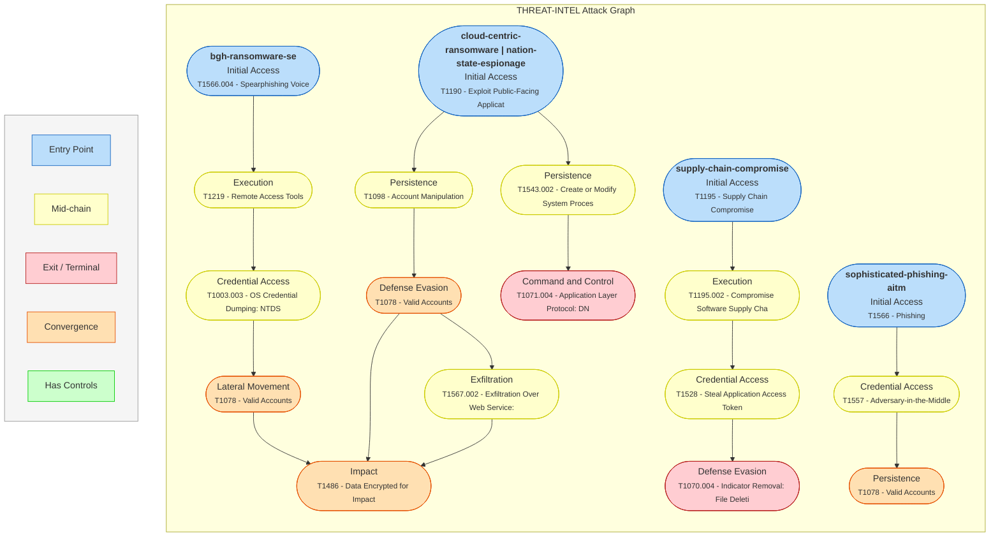

**Paths:**
- **bgh-ransomware-se**: A social engineering-led attack abusing unmanaged virtual systems to steal credentials and deploy ransomware.
- **cloud-centric-ransomware**: Attack path exploiting edge devices then leveraging cloud identity manipulation for persistence, data exfiltration, and impact.
- **nation-state-espionage**: Espionage campaign using rapid exploitation of perimeter devices for long-term C2 and intelligence collection.
- **supply-chain-compromise**: Compromise of a software developer to inject malicious code into a product and attack downstream customers.
- **sophisticated-phishing-aitm**: A multi-layered trust abuse campaign using social engineering and AiTM to bypass MFA and gain access.

**Convergence:** T1486 (Impact), T1078 (Lateral Movement)