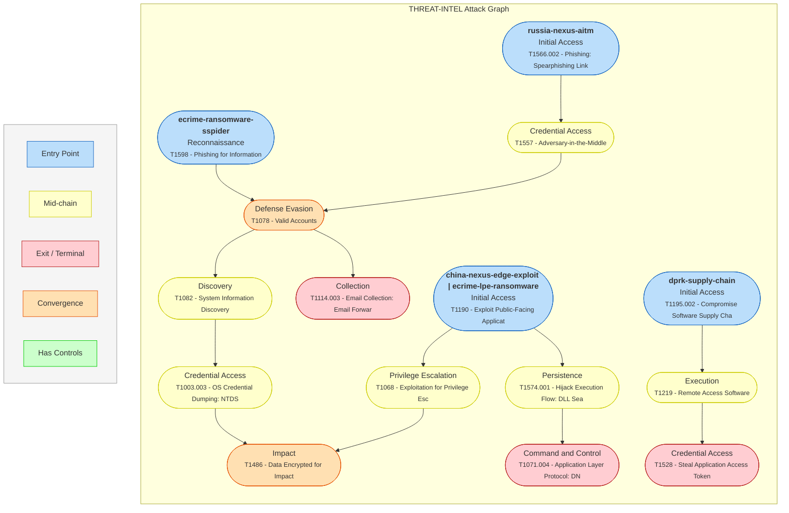

**Paths:**
- **ecrime-ransomware-sspider**: SCATTERED SPIDER's attack path using social engineering to access VMware infrastructure for credential theft and ransomware deployment.
- **china-nexus-edge-exploit**: China-nexus actors' typical path exploiting internet-facing devices for long-term intelligence collection.
- **russia-nexus-aitm**: COZY BEAR's multi-layered trust abuse campaign using Adversary-in-the-Middle phishing to compromise cloud accounts.
- **dprk-supply-chain**: DPRK-nexus actors' use of software supply chain compromises for financial theft and espionage.
- **ecrime-lpe-ransomware**: General eCrime path involving exploitation of a public-facing app followed by LPE before impact.

**Convergence:** T1078 (Defense Evasion), T1486 (Impact)